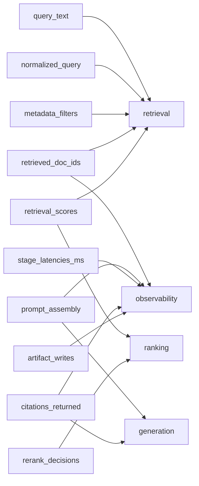

# 遥测合约

## 目的

本合约定义外部 RAG 系统在调用本仓库进行诊断之前应具备的最小 trace 字段，供系统集成方和诊断调用方对齐输入边界。

## 适用范围

本仓库不实现采集，只规定外部 RAG 系统调用方做诊断之前应当具备的最小可观测性字段。

字段命名采用抽象契约名，不绑定任何采集工具、日志平台或链路追踪系统。

## 字段表

| 字段名 | 类型 | 必填或可选 | 取值约束 | 示例 | 诊断用途说明 |
|---|---|---|---|---|---|
| `query_text` | string | 必填 | 原始用户查询文本；不得为空字符串 | `"<query-text>"` | 支撑 retrieval 与 generation 判断，用于确认问题意图是否在进入检索前已经缺失、含混或超出语料范围。 |
| `normalized_query` | string | 可选 | 归一化、改写或扩展后的查询文本；没有改写时可与 `query_text` 相同 | `"<normalized-query>"` | 支撑 retrieval 判断，用于比较查询改写是否改变意图、引入过宽或过窄的检索条件。 |
| `retrieved_doc_ids` | array[string] | 必填 | 按检索阶段输出顺序排列；元素为抽象文档标识 | `["<doc_42>","<doc_57>"]` | 支撑 retrieval 与 observability 判断，用于确认是否召回了候选文档，以及候选集合是否可追踪。 |
| `retrieval_scores` | array[number] | 必填 | 与 `retrieved_doc_ids` 一一对应；分数含义由调用方系统定义 | `[<score>,<score>]` | 支撑 retrieval 与 ranking 判断，用于判断召回分数分布、阈值截断和候选排序是否异常。 |
| `metadata_filters` | object | 可选 | 键值均为可 JSON 序列化的抽象过滤条件；没有过滤条件时可为空对象 | `{"<filter-key>":"<filter-value>"}` | 支撑 retrieval 判断，用于识别过滤条件是否误排除了相关语料或扩大了检索范围。 |
| `rerank_decisions` | array[object] | 可选 | 每项描述 rerank 前后位置、文档标识和抽象决策原因 | `[{"doc_id":"<doc_42>","before_rank":<rank>,"after_rank":<rank>,"reason":"<reason>"}]` | 支撑 ranking 判断，用于定位候选文档在重排阶段被提升、降级或丢弃的原因。 |
| `prompt_assembly` | object | 必填 | 描述最终 prompt 的组成块、引用的文档标识和上下文截断信息；不要求保存完整正文 | `{"blocks":["<system-block>","<context-block>"],"doc_ids":["<doc_42>"],"truncation":"<truncation-state>"}` | 支撑 generation 与 observability 判断，用于确认可用证据是否进入 prompt，以及上下文组装是否发生丢失或截断。 |
| `stage_latencies_ms` | object | 必填 | 键为阶段名，值为毫秒级耗时数值 | `{"retrieval":<latency-ms>,"rerank":<latency-ms>,"generation":<latency-ms>}` | 支撑 observability 判断，用于定位检索、重排、生成等阶段的延迟异常和缺失阶段。 |
| `citations_returned` | array[object] | 必填 | 每项描述返回给用户的引用标识、文档标识和可选片段定位 | `[{"citation_id":"<citation_1>","doc_id":"<doc_42>","span":"<span-ref>"}]` | 支撑 generation 与 observability 判断，用于确认最终答案是否带有可追踪引用，以及引用是否指向已检索证据。 |
| `artifact_writes` | array[object] | 可选 | 每项描述运行过程中写出的中间产物类型、路径或抽象标识、写入状态 | `[{"artifact_type":"<artifact-type>","artifact_ref":"<artifact-ref>","status":"<write-status>"}]` | 支撑 observability 判断，用于确认诊断所需的中间产物是否被记录，以及写入失败是否导致证据缺口。 |

## 故障家族映射图

## 不实现声明

本仓库不提供 SDK。

本仓库不实现遥测采集。

本仓库不背书任何采集工具。
